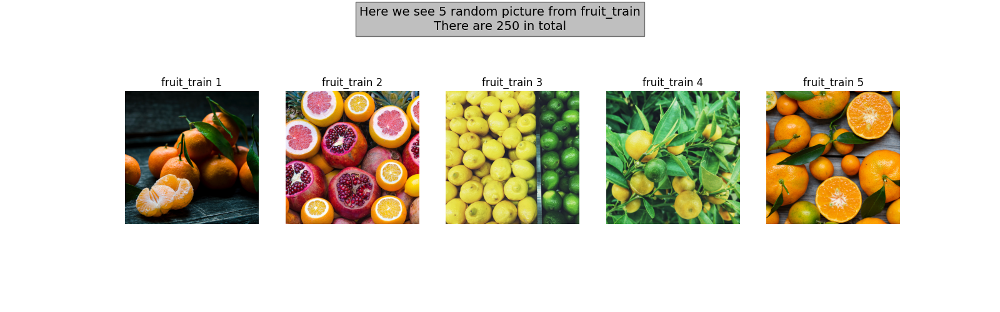
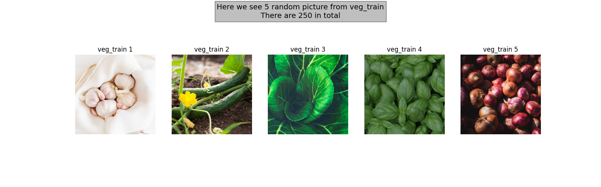
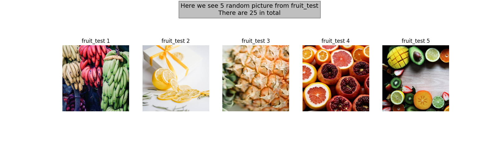
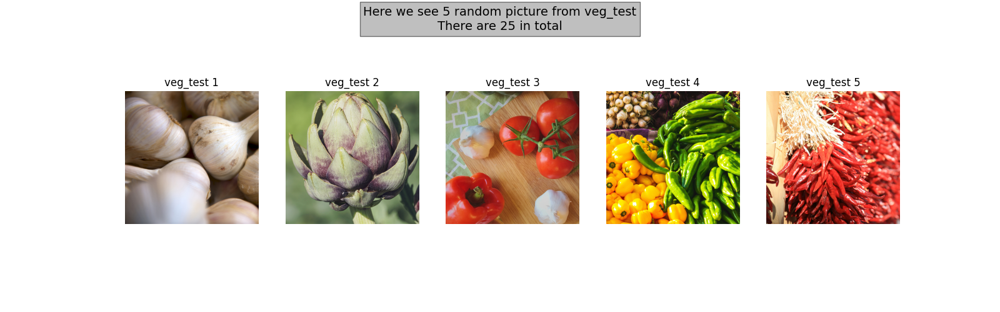
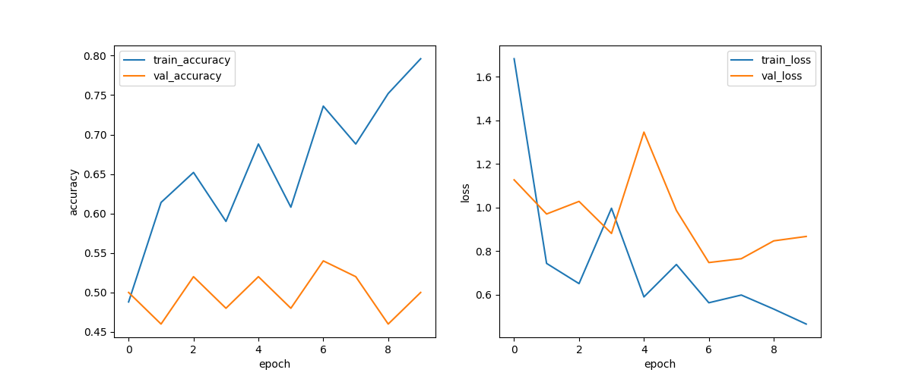

<a id="up"></a>
<p align="center">
<a href="https://git.io/typing-svg"></a>
</p>


<h1> Фрукт или овощ? Вот в чем вопрос... </h1>
<p align="left">
  <a href="https://github.com/svyatoslav-rozhdestvenskiy">
    
  </a>
  
  

</p>
<body style="background-color: #000000; color:#008000">

<p style="color:#8A2BE2">
Данный репозиторий поможет вам решить самую базовую задачу машинного обучения, а именно задачу классификации.
Здесь мы попробуем заставить машину отличать фрукты и овощи, изображенные на картинке
</p>
</body> 
<p align="center">

</p>
<h1> Данные </h1>

<p style="color:#8A2BE2">
На данный момент у нас имеется по 250 картинок фруктов и овощей для тренировки, а также по 25 для теста
</p>
<br>




<h1> Результаты </h1>

<p style="color:#8A2BE2">
Пока результаты не очень утешительные, точность прогноза около 50 %, но сейчас ведется активная работа по улучшению
</p>

<br>


<h1> Установка </h1>

<p style="color:#8A2BE2">
1. Клонируйте репозиторий
</p>

```commandline
git clone https://github.com/svyatoslav-rozhdestvenskiy/fruit_vs_vegetables.git
```
<p style="color:#8A2BE2">
2. Перейдите в папку программы
</p>

```commandline
cd fruit_vs_vegetables
```

<p style="color:#8A2BE2">
3. Создайте новый проект или новое виртуальное окружение
</p>

<p style="color:#8A2BE2">
4. Установите все необходимые библиотеки
</p>

```commandline
pip3 install -r requirements.txt
```
<p style="color:#8A2BE2">
5. Пользуйтесь)
</p>

<h1> Kaggle </h1>
<p style="color:#8A2BE2">
Проект удобнее запускать на ноутбуке, поэтому оставляю <a href="https://github.com/svyatoslav-rozhdestvenskiy">ссылку на мой ноутбук там</a>
</p>

<h1> Пожелания и рекомендации </h1>
<p style="color:#8A2BE2">
Если вас заинтересовал проект и у вас есть предложения по его улучшению, то пишите, не стесняйтесь.
Мои контакты вы сможете найти на <a href="https://www.kaggle.com/code/rozhdestvenskiysvyat/rozh-fruit-veg">главной странице профиля</a>
</p>
<a href="#up">Ссылка для перехода наверх, чтобы не листать</a>